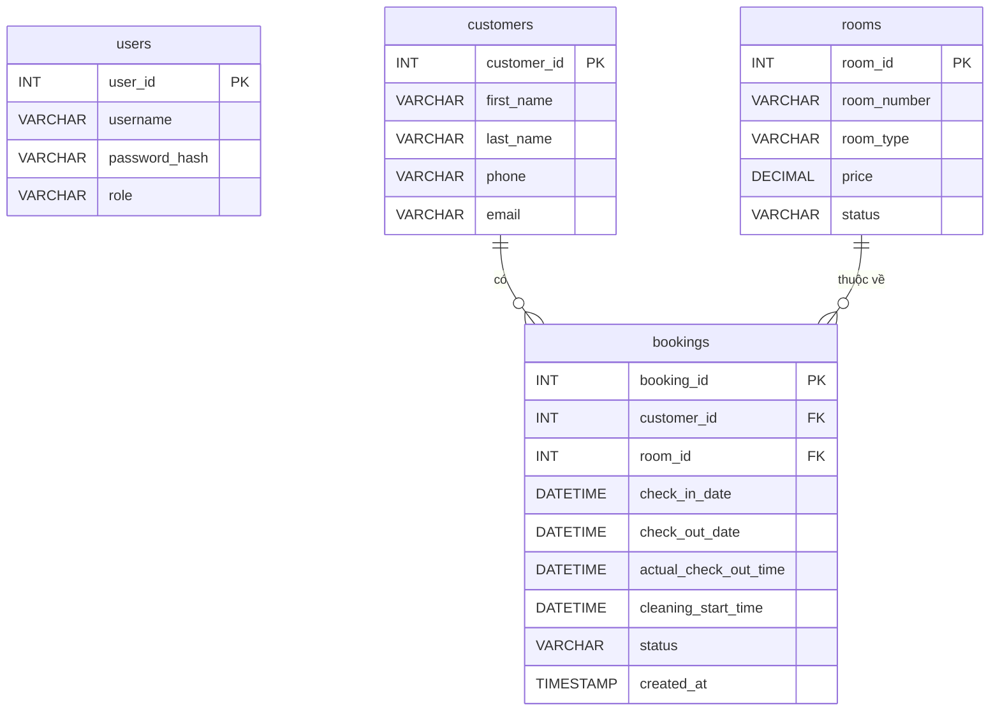

# Sơ đồ Thực thể Liên kết (ERD) - Database Schema

```mermaid
erDiagram
    users {
        INT user_id PK
        VARCHAR username
        VARCHAR password_hash
        VARCHAR role
    }

    rooms {
        INT room_id PK
        VARCHAR room_number
        VARCHAR room_type
        DECIMAL price
        VARCHAR status
    }

    customers {
        INT customer_id PK
        VARCHAR first_name
        VARCHAR last_name
        VARCHAR phone
        VARCHAR email
    }

    bookings {
        INT booking_id PK
        INT customer_id FK
        INT room_id FK
        DATETIME check_in_date
        DATETIME check_out_date
        DATETIME actual_check_out_time
        DATETIME cleaning_start_time
        VARCHAR status
        TIMESTAMP created_at
    }

    customers ||--o{ bookings : "có"
    rooms ||--o{ bookings : "thuộc về"
```
