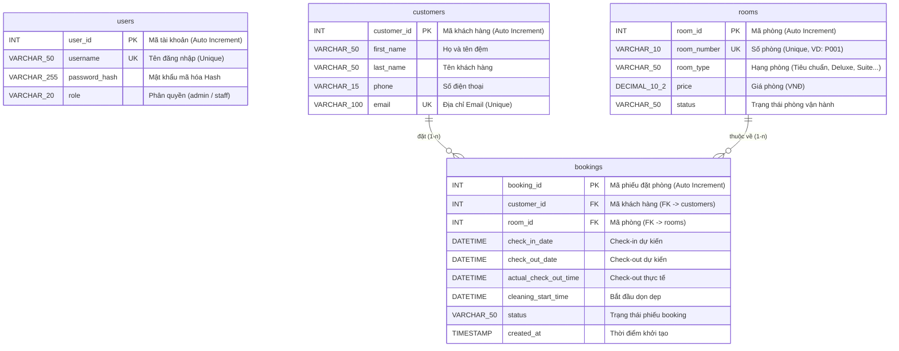

# 📊 Sơ đồ Thực thể Liên kết (ERD) - Database Schema
**Hệ thống Quản lý Đặt phòng Khách sạn - HAI YEN Hotel Management**

---

## 1. Sơ đồ Mermaid ERD

---

## 2. Mô tả Chi tiết các Bảng Dữ liệu (Database Tables)

### 2.1. Bảng `users` (Tài khoản Nội bộ)
- **Mục đích:** Quản lý tài khoản đăng nhập và phân quyền dành cho Nhân viên (Staff) và Quản trị viên (Admin).
- **Chi tiết các trường:**
  - `user_id` (`INT`, Primary Key, Auto Increment): Định danh duy nhất cho tài khoản.
  - `username` (`VARCHAR(50)`, Unique, Not Null): Tên đăng nhập hệ thống.
  - `password_hash` (`VARCHAR(255)`, Not Null): Mật khẩu đã mã hóa bảo mật.
  - `role` (`VARCHAR(20)`, Default `'staff'`): Vai trò người dùng (`admin` hoặc `staff`).

### 2.2. Bảng `rooms` (Danh mục Phòng Khách sạn)
- **Mục đích:** Quản lý thông tin chi tiết các phòng, đơn giá và trạng thái thời gian thực.
- **Chi tiết các trường:**
  - `room_id` (`INT`, Primary Key, Auto Increment): Định danh duy nhất cho phòng.
  - `room_number` (`VARCHAR(10)`, Unique, Not Null): Số hiệu phòng (Ví dụ: `P001`, `P002`...).
  - `room_type` (`VARCHAR(50)`): Hạng phòng (`Tiêu chuẩn`, `Thoải mái`, `Deluxe`, `Suite`, `VIP`, `Gia đình`).
  - `price` (`DECIMAL(10,2)`): Đơn giá phòng theo ngày.
  - `status` (`VARCHAR(50)`, Default `'Trống'`): Trạng thái phòng thời gian thực (`Trống`, `Đã book`, `Đã check in`, `Đã check out`, `Đang vệ sinh`, `Bảo trì`).

### 2.3. Bảng `customers` (Thông tin Khách hàng)
- **Mục đích:** Lưu trữ hồ sơ khách hàng phục vụ quá trình liên lạc và gửi thông báo xác nhận booking.
- **Chi tiết các trường:**
  - `customer_id` (`INT`, Primary Key, Auto Increment): Định danh duy nhất cho khách hàng.
  - `first_name` (`VARCHAR(50)`, Not Null): Họ và tên đệm.
  - `last_name` (`VARCHAR(50)`, Not Null): Tên chính.
  - `phone` (`VARCHAR(15)`, Not Null): Số điện thoại liên hệ.
  - `email` (`VARCHAR(100)`, Unique, Not Null): Email cá nhân nhận xác nhận đặt phòng.

### 2.4. Bảng `bookings` (Vận hành & Chi tiết Đặt phòng)
- **Mục đích:** Quản lý lịch trình đặt phòng, khoảng thời gian lưu trú và vòng đời dọn dẹp phòng.
- **Chi tiết các trường:**
  - `booking_id` (`INT`, Primary Key, Auto Increment): Định danh duy nhất phiếu đặt phòng.
  - `customer_id` (`INT`, Foreign Key): Liên kết đến `customers(customer_id)`.
  - `room_id` (`INT`, Foreign Key, Not Null): Liên kết đến `rooms(room_id)`.
  - `check_in_date` (`DATETIME`, Not Null): Ngày giờ check-in dự kiến.
  - `check_out_date` (`DATETIME`, Not Null): Ngày giờ check-out dự kiến.
  - `actual_check_out_time` (`DATETIME`, Nullable): Thời điểm thực tế khách làm thủ tục check-out.
  - `cleaning_start_time` (`DATETIME`, Nullable): Thời điểm khởi chạy tính giờ dọn phòng (30 phút).
  - `status` (`VARCHAR(50)`, Default `'PENDING'`): Trạng thái booking (`PENDING`, `CHECKED_IN`, `CHECKED_OUT`, `CLEANING`, `COMPLETED`, `CANCELLED`, `MAINTENANCE`).
  - `created_at` (`TIMESTAMP`, Default `CURRENT_TIMESTAMP`): Ngày giờ tạo đơn.

---

## 3. Quan hệ Thực thể (Cardinality)
- **`customers` (1) — (n) `bookings`**: Một khách hàng có thể tạo nhiều đơn đặt phòng.
- **`rooms` (1) — (n) `bookings`**: Một phòng có thể gắn liền với nhiều đơn đặt phòng qua các khoảng thời gian khác nhau.

